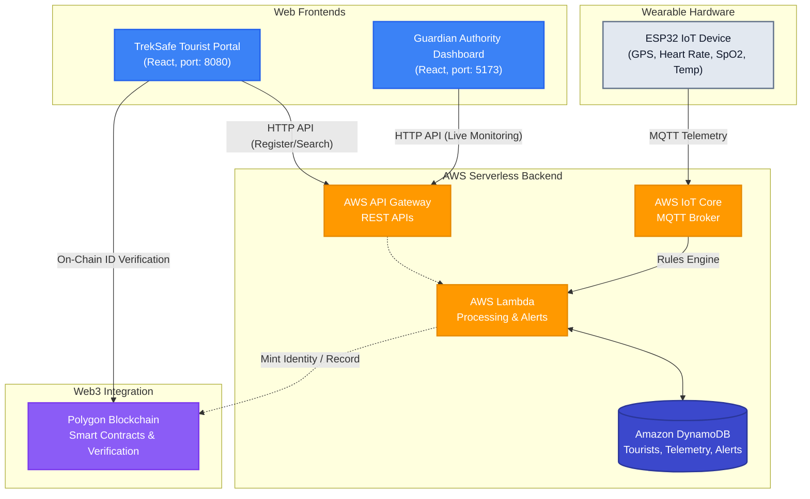

# 🏔️ Tourist Safety Monitoring System (TrekSafe & Guardian)

An end-to-end, real-time safety monitoring and emergency alerting ecosystem designed for trekkers and wilderness authorities. The system integrates IoT wearable devices, serverless cloud backend, decentralized blockchain verification, and two distinct user interfaces for tourists and park rangers.

---

## 🏗️ System Architecture



---

## 📂 Project Repository Structure

The repository is modularly organized to separate frontend apps, backend code, IoT firmware, and setup guides:

*   **[tourist-portal](./tourist-portal/)**: React portal (`vite`) for trekker registration, safety briefings, emergency contact setup, and verifiable check-ins linked to blockchain identity. Runs on port `8080`.
*   **[guardian-dashboard](./guardian-dashboard/)**: React command center (`vite`) for safety rangers. Features real-time mapping of trekkers, live vitals monitoring, SOS alert feeds with desktop notifications, and dark-mode styling support. Runs on port `5173`.
*   **[backend-lambda](./backend-lambda/)**: Node.js microservices deployed on AWS Lambda to process incoming REST API requests (registration, fetching telemetry, listing active alerts) and minting blockchain proofs.
*   **[firmware-esp32](./firmware-esp32/)**: C++ Arduino firmware for the ESP32 wearable device, processing GPS signals, calculating accelerometer magnitude for automated fall detection, and capturing vitals.
*   **[docs/deployment-guide.md](./docs/deployment-guide.md)**: A complete, comprehensive step-by-step installation and production configuration guide covering AWS setup, Cognito Auth, DynamoDB, IoT rules, and Smart Contract deployments.

---

## 🛠️ Tech Stack

- **IoT Wearable**: ESP32, NEO-6M GPS, MPU6050 Accelerometer/Gyro, MAX30102 Heart Rate/SpO2, DS18B20 Temp sensor.
- **Cloud Backend**: AWS IoT Core (MQTT Broker & Rules Engine), AWS API Gateway, AWS Lambda (Node.js), Amazon DynamoDB, Amazon SNS (SMS/Email alerts), Amazon Cognito (Authority authentication).
- **Web UIs**: React (Vite), TypeScript, Tailwind CSS, Lucide Icons, Leaflet / Mapbox for GIS mapping.
- **Blockchain Core**: Solidity Smart Contracts, ethers.js, Polygon Amoy Testnet.

---

## 🚀 Quick Start Guide

### 1. Run the Frontends Locally

#### Tourist Portal
```bash
cd tourist-portal
npm install
npm run dev
# App will open at http://localhost:8080
```

#### Guardian Dashboard
```bash
cd guardian-dashboard
npm install
npm run dev
# App will open at http://localhost:5173
```

### 2. Deploy Backend Functions
The `backend-lambda` folder contains the core request-handling scripts. See [docs/deployment-guide.md](./docs/deployment-guide.md) to bundle dependencies (`npm install`) and deploy them to AWS.

### 3. Flash IoT Firmware
Open the [firmware-esp32/tourist_safety.ino](./firmware-esp32/tourist_safety.ino) sketch in Arduino IDE, create a `secrets.h` file from the template [secrets.h](./firmware-esp32/secrets.h) to add your WiFi SSID, password, and downloaded AWS IoT certificates, and flash it to your ESP32 device.

---

## 📋 Complete Step-by-Step Setup
For detailed setup instructions on creating DynamoDB tables, configuring Cognito User Pools, setting up MQTT Rules in AWS IoT Core, and deploying Polygon Smart Contracts, please refer to the **[Complete Deployment Guide](./docs/deployment-guide.md)**.
